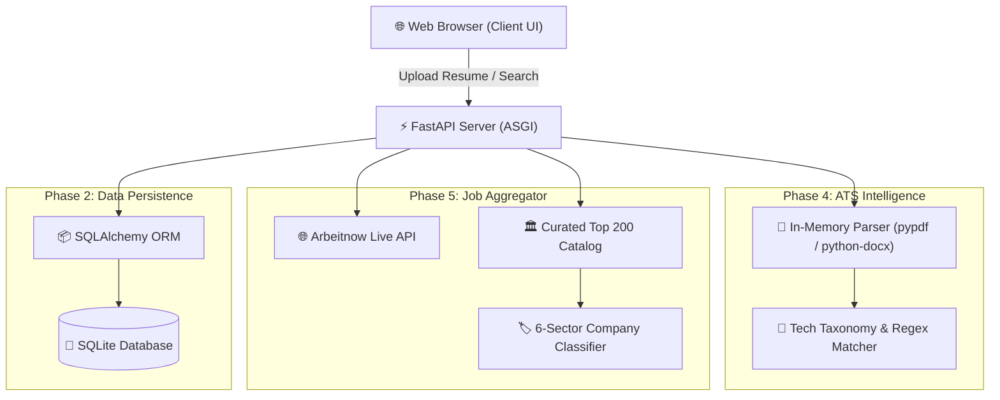

# ⚡ CareerPulse — Smart Job Tracker & ATS Matching Engine

[](https://fastapi.tiangolo.com)
[](https://python.org)
[](https://tailwindcss.com)
[](https://sqlite.org)
[](https://pytest.org)

> An end-to-end full-stack web application that combines **real-time internet job scraping**, an **in-memory ATS (Applicant Tracking System) resume scoring engine**, and a **Kanban-style application tracker** with automated LinkedIn recruiter outreach.

---

## 🌟 Key Superpowers & Features

### 1. 📄 Zero-Disk In-Memory ATS Resume Scorer
- Accepts `.pdf` and `.docx` candidate resumes directly into RAM memory via `io.BytesIO` streams (preventing hard disk clutter and disk I/O bottlenecks).
- Utilizes normalized technical taxonomy and regex word boundary matching to extract candidate skills in sub-milliseconds.
- Calculates an exact **ATS Match Compatibility Score (0–100%)** against real job descriptions.

### 2. ⚡ Live Internet Job Aggregator (Arbeitnow API)
- Real-time HTTP ingestion from Arbeitnow's public developer API merged with a curated Top 200 benchmark catalog.
- Multi-dimensional sieve filtering across **6 Core Tech Sectors**:
  - *Big Tech*, *Product SaaS & AI*, *Fintech*, *European Tech*, *Indian Unicorns*, and *IT Services*.
- Standardized salary ranges in Indian Rupees (**₹ LPA** or monthly stipend).

### 3. 🎯 1-Click Track to Local SQLite Database
- Seamlessly transition from searching to tracking: click **"Track"** on any live internet opportunity to instantly persist it into your relational SQLite database.
- Complete CRUD dashboard with metrics, status filtering (*Applied, Interviewing, Offer, Rejected*), and in-place editing.

### 4. 🤝 Dynamic LinkedIn Recruiter Outreach
- Automatically constructs deep-link search queries into LinkedIn’s hiring graph for every employer (`https://www.linkedin.com/search/results/people/?keywords=technical+recruiter+{company}`).

---

## 🏗️ System Architecture



---

## 📂 Project Structure

```text
Job_Finding_Website/
├── app/
│   ├── main.py                  # ASGI Application & Route Orchestrator
│   ├── database.py              # SQLAlchemy DB Engine & Session Dependency
│   ├── models.py                # Database Table Schema (JobApplication)
│   ├── schemas.py               # Pydantic Schemas for Strict Data Validation
│   ├── routers/
│   │   ├── jobs.py              # Application Tracker CRUD Endpoints
│   │   └── discover.py          # Live Aggregator & ATS Matching Endpoints
│   ├── services/
│   │   ├── ats_matcher.py       # Taxonomy, Regex Parser & Scoring Formula
│   │   ├── top_companies.py     # Top 200 Employers Directory & Recruiter Links
│   │   └── job_fetcher.py       # Arbeitnow Live API Ingestion & ATS Ranker
│   ├── templates/
│   │   ├── base.html            # Dark-Theme Shell & Navigation Bar
│   │   ├── index.html           # Job Tracker Dashboard & Metric Cards
│   │   └── discover.html        # Live Search UI, Resume Dropzone & Modal
│   └── static/
│       └── js/
│           ├── app.js           # Tracker DOM Manipulation & AJAX Calls
│           └── discover.js      # ATS Dropzone, Live Filtering & Card Renderer
├── tests/
│   ├── test_matcher.py          # Automated ATS Engine Unit Tests
│   └── test_discover.py         # End-to-End API Integration Tests
├── requirements.txt             # Locked Dependencies
└── README.md                    # Project Documentation
```

---

## 🚀 Quickstart & Installation

### 1. Clone the repository
```bash
git clone https://github.com/dukthem/Job_Finding_Website.git
cd Job_Finding_Website
```

### 2. Create and activate a Virtual Environment
```bash
# macOS / Linux
python3 -m venv venv
source venv/bin/activate
```

### 3. Install Dependencies
```bash
pip install -r requirements.txt
```

### 4. Run the Application
```bash
uvicorn app.main:app --reload
```
Open your browser and navigate to:
- **Application Dashboard:** `http://127.0.0.1:8000`
- **Discover Jobs & ATS Matcher:** `http://127.0.0.1:8000/discover`
- **Interactive Swagger API Docs:** `http://127.0.0.1:8000/docs`

---

## 🧪 Running Automated Tests

Run the complete test suite with `pytest`:
```bash
pytest -v
```

---

## 📜 License
Open-source under the [MIT License](LICENSE).
